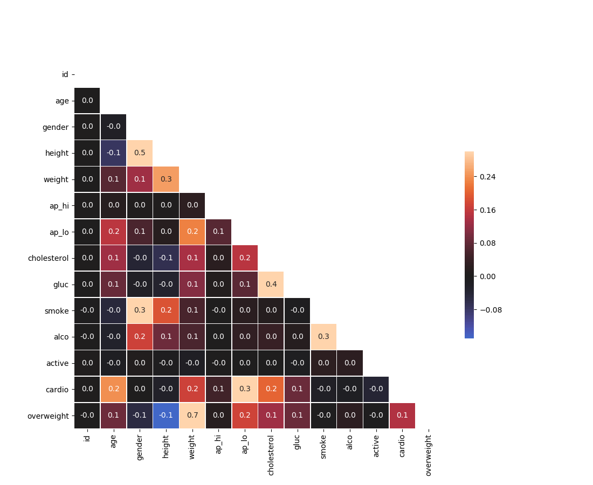

## Table of Contents
{: .no_toc .text-delta }

{: .fs-2 }
- TOC
{:toc}

---

<html>
  <details>
    <summary>💻 <strong class="text-green-200">ACTIVITY PROGRAM SETUP INSTRUCTIONS</strong></summary>
    
<div class="setup" markdown="block">

1. Go to the public template **repository** for our class: [BWL-CS Python Template](https://github.com/BWL-CS/python-template)
2. Click the <button type="button" name="button" class="btn btn-green">Use this template</button> button above the list of files then select `Create a new repository`
3. Specify the **repository name**: `CS3-Unit2-Activity#`
    > Replace `#` with the specific _activity number_.
4. Click <button type="button" name="button" class="btn btn-green">Create repository</button>
    > Now you have **your own personal copy** of this starter code that you can always access under the `Your repositories` section of GitHub! 📂
5. Now on your repository, click <button type="button" name="button" class="btn btn-green"> < > Code </button> and select the `Codespaces` tab
6. Click `Create Codespace on main` and wait for the environment to load, _then you're ready to code_!

</div>

<br>

<div class="warn" markdown="block">

🛑 When class ends, don't forget to **SAVE YOUR WORK**! **Codespaces** are TEMPORARY editing environments, so you need to COMMIT changes properly in order to update the main **repository** for your program. 

_There are multiple steps to saving in GitHub Codespaces:_

1. Navigate to the `Source Control` menu on the _LEFT_ sidebar
2. Click the <button type="button" name="button" class="btn btn-green">commit changes</button> button on the _LEFT_ menu
3. Type a brief **commit message** at the top of the file that opens, for example: `updated main.py`
4. Click the small `✔️` **checkmark** in the _TOP RIGHT_ corner
5. Click the <button type="button" name="button" class="btn btn-green">sync changes</button> button on the _LEFT_ menu
6. _Finally you can close your Codespace!_

</div>

  </details>
</html>

---

## 🐼 ACTIVITY #1: Pandas Movie Data

Data scientists have to deal with a lot of data at once. While Google Sheets and Excel are great ways to visualize and manipulate data, they are not as _versatile_ as we might want. In this project, you will practice using **data frames** and learn to use them to obtain information from data.

### PART A: Exploring the Data

We're going to be using a dataset about movies to try out processing some data with the `Pandas` library. A [Python Library](https://www.geeksforgeeks.org/libraries-in-python/) is a collection of related modules. It contains bundles of code that can be used repeatedly in different programs.

<div class="task" markdown="block">

1. We start with some standard **imports**:
```python
import pandas as pd
import numpy as np
```
2. Download the `movies_metadata.csv` file from [Kaggle](https://www.kaggle.com/rounakbanik/the-movies-dataset) and upload it to your repository. 
3. **Load** the data from a local file using `pandas`:
```python
df = pd.read_csv('movies_metadata.csv').dropna(axis=1, how='all')
df.head()
```
4. Let's see how much data we have:
```python
df.shape
```
5. Twenty-three columns of data for over 45,000 movies is going be a lot to look
at, but let's start by looking at what the columns represent:
```python
df.info()
```

</div>

<br>

<html>
<details>
<summary>EXPLANATION OF COLUMNS</summary>

<div markdown="block">
  
- **belongs_to_collection:** A stringified dictionary that identifies the
  collection that a movie belongs to (if any).
- **budget:** The budget of the movie in dollars.
- **genres:** A stringified list of dictionaries that list out all the genres
  associated with the movie.
- **homepage:** The Official Homepage of the movie.
- **id:** An arbitrary ID for the movie.
- **imdb_id:** The IMDB ID of the movie.
- **original_language:** The language in which the movie was filmed.
- **original_title:** The title of the movie in its original language.
- **overview:** A blurb of the movie.
- **popularity:** The Popularity Score assigned by TMDB.
- **poster_path:** The URL of the poster image (relative to
  http://image.TMDB.org/t/p/w185/).
- **production_companies:** A stringified list of production companies involved
  with the making of the movie.
- **production_countries:** A stringified list of countries where the movie was
  filmed or produced.
- **release_date:** Theatrical release date of the movie.
- **revenue:** World-wide revenue of the movie in dollars.
- **runtime:** Duration of the movie in minutes.
- **spoken_languages:** A stringified list of spoken languages in the film.
- **status:** Released, To Be Released, Announced, etc.
- **tagline:** The tagline of the movie.
- **title:** The official title of the movie.
- **video:** Indicates if there is a video present of the movie with TMDB.
- **vote_average:** The average rating of the movie on TMDB.
- **vote_count:** The number of votes by users, as counted by TMDB.

</div>
</details>
</html>

### PART B: Filtering the Data

Let’s start by only looking at films that cost over a million dollars to make.

<div class="task" markdown="block">

Create a variable called ``budget_df`` that pulls the entire row (contains all columns) for any movies whose value in the `'budget'` column was **over a million dollars**.
```python
# Fill in brackets with a CONDITIONAL
budget_df = df[] 
print(budget_df.shape)
```

</div>

> 💬: *How many movies have a budget over 1 million dollars?* 

With this more manageable list of 7000+ movies, I’d like to have a way to **look
up the budget** of a particular movie.

<div class="task" markdown="block">

Create a **Series** object called ``budget_lookup`` such that you are able to use a
call to ``budget_lookup['Movie Title']`` to find the budget of that movie. 
```python
# Fill in the parameters for (values, index)
budget_lookup = pd.Series()
```
Print out the first five rows of the `budget_lookup` Series.

</div>

> 💬: *What was the budget for Jumanji?* 

Let's say I have figured out that the first (alphabetically) movie whose title starts with an "A" is "A Bag of Hammers" and the last movie that starts with a "B" is
"Byzantium".

```python
# Get FIRST movie whose title starts with A
budget_lookup[budget_lookup.index.str.startswith('A')].sort_index()[[0]]
# Get LAST movie whos title starts with B
budget_lookup[budget_lookup.index.str.startswith('B')].sort_index()[[-1]]
```

<div class="task" markdown="block">

Use that knowledge to create a `Series` that contains budget data for all the movies that start with an "A" or a "B". 

> **Hint:** No need to use ``startswith`` like I did above, just use the two movie **titles** I found and compare `budget_lookup.index` to them.

```python
# First define the condition to be checked
condition = 

# Pull rows conditionally
budget_lookup_A_B = budget_lookup[condition]
```

</div>

> 💬: ***How many** movies with a budget of over a million dollars AND whose title starts with an "A" or a "B" are there?*

### PART C: Numbers as Indices

Enough about movie budgets, it's time to budget my time instead. Because I
schedule my day to the minute, I like to be able to look up movies by their
runtime, so that when I have a spare two hours and 34 minutes, I can find all
the movies that would fit precisely in that time slot. (Popcorn-making time is
budgeted separately).

Before you start, here is a refresher on the index operator in Pandas:

<div class="imp" markdown="block">
  
**Selecting Columns of a DataFrame**

* ``df[<string>]`` gets me a column and returns the **Series** corresponding to that
  column.
* ``df[<list of strings>]`` gets me a bunch of columns and returns a **DataFrame**.

**Selecting Rows of a DataFrame**

* ``df[<series/list of Boolean>]`` gets me the rows for each element in the
  list like thing you passed me that is ``True``.  However, I think this is
  confusing and whenever you want to select some rows of a DataFrame you should
  use ``df.loc[]``.
* ``df.loc[<series/list of Boolean>]`` behaves just like
  ``df[<series/list of Boolean>]``.
* ``df.loc[<string>]`` uses the non-numeric row index and returns the row(s) for
  that index value.
* ``df.loc[<string1>:<string2>]`` uses the non-numeric index and returns a data
  frame composed of the rows starting with string1 and ending with each string2.
* ``df.loc[<list/Series of strings>]`` returns a data frame composed of each row
  from df with an index value that matches a string in the list.

If you use an integer in any of the last four examples, it works just like the
string, but the index values are numeric instead. What is important (and
confusing) about this is that they use the index, not the position. So, if you
create a data frame with 4 rows of some data, it will have an index that is
created by default where the first row starts with 0, the next row is 1 and so
on. However, if you sort the data frame such that the last row becomes the first
and the first row becomes the last, using ``df.loc[0]`` on the sorted data frame
will return the last row.

If you want to be strictly positional, you should use ``df.iloc[0]``, which will
return the first row regardless of the index value. ``df.iloc[0:5]`` is the same
as doing ``df.head()``, and ``df.iloc[[1, 3, 5, 7]]`` will return four rows: the
2nd, 4th, 6th and 8th.

```python
df = pd.DataFrame({'a':list("pythonrocks"), 'b':[1,2,3,4,5,6,7,8,9,10,11]})
df = df.set_index('a')
df.loc['p':'n']
```

OK, but what if we do this:

```python
 df.loc['p':'o']
```

Pandas raises an error because there are two 'o's in the index.  It doesn't know which one you mean, first? last? If you argue it should use the last then consider the performance implications if this was a really large index? In that case it would be very time consuming to search the index for the last occurance.

On the other hand, if we sort the index then the last instance can be found quite quickly, and with a sorted index loc will work for this example.

```python
df = df.sort_index()
df.loc['c':'o']
```
</div>

<br>

<div class="task" markdown="block">
  
1. Create a Series called ``movies_by_runtime`` that is indexed by runtime and has the
movie's title as its values. Note that you will need to use ``sort_index()`` in
order to be able to look up movies by their duration. Base yourself on the original ``df``
rather than ``budget_df``.

2. While you’re at it, filter to excluse any movie that is **less than 10 minutes** (_you can’t get into it if it's too short_) or **longer than 3 hours** (who's got time for that?).

> **Hint:** You may MAY to use ``pd.to_numeric`` to force the runtimes to be
numbers (instead of strings).

Here is a simpler example that shows the movies that are exactly 7 minutes long:

```python
movies_by_runtime = pd.Series(df['title'].values, index=df['runtime'])
movies_by_runtime = movies_by_runtime.sort_index()
print(movies_by_runtime.loc[7])
```
</div>

> 💬: How many movies lasting exactly **154 minutes** are there?

> 💬: What is the **155th** shortest movie in this collection? (_Make sure you are using `iloc` and not `loc`!_)


### PART D: Dealing with Multiple DataFrames

Forget about budget or runtimes as criteria for selecting a movie, let's take a
look at **popular opinion**. Our dataset has two relevant columns: ``vote_average``
and ``vote_count``.

<div class="task" markdown="block">

Let's create a variable called ``df_high_rated`` that only contains movies that
have received more than 20 votes, and whose average score is greater than 8.

```python
df_highly_voted = df[df.vote_count > 20]
df_high_rated = df_highly_voted[df_highly_voted.vote_average > 8]
df_high_rated[['title', 'vote_average', 'vote_count']].head()
```

Here we have some high-quality movies, at least according to some people.
</div>

> 💬: How many highly-rated movies are in this dataset? 

But what about **my** opinion?

<div class="task" markdown="block">

Here are my favorite movies and their relative scores. Create a DataFrame called
``compare_votes`` that contains the title as an index and both the
``vote_average`` and ``my_vote`` as its columns. Also, only keep the movies that
are both my favorites and popular favorites.

> **Hint:** You'll need to create two Series, one for my ratings and one that maps
titles to vote_average.

```python
my_votes = {
       "Star Wars": 9,
       "Paris is Burning": 8,
       "Dead Poets Society": 7,
       "The Empire Strikes Back": 9.5,
       "The Shining": 8,
       "Return of the Jedi": 8,
       "1941": 8,
       "Forrest Gump": 7.5,
   }
```

</div>

> 💬: What's the **percentage difference** between the popular rating for Star Wars and my vote for it? (_Make sure you use the popular rating minus my rating, and convert your answer to a percentage._)

> 💬: Make up 3 questions you would like to answer about this movie data using the techniques you have learned.

---

## 🌊 ACTIVITY #2: Medical Data with Seaborn

In this project, you will visualize and make calculations from medical examination data using `matplotlib`, `seaborn`, and `pandas`. The dataset values were collected during medical examinations.

#### STARTER CODE
{:.no_toc}

```python
import pandas as pd
import seaborn as sns
import matplotlib.pyplot as plt
import numpy as np

# Import data
df = None

# Add 'overweight' column
df['overweight'] = None

# Normalize data by making 0 always good and 1 always bad. If the value of 'cholesterol' or 'gluc' is 1, make the value 0. If the value is more than 1, make the value 1.


# Function to draw Categorical Plot
def draw_cat_plot():
  # Create DataFrame for cat plot using `pd.melt` using just the values from 'cholesterol', 'gluc', 'smoke', 'alco', 'active', and 'overweight'.
  df_cat = None

  # Group and reformat the data to split it by 'cardio'. Show the counts of each feature. You will have to rename one of the columns for the catplot to work correctly.
  df_cat = None

  # Draw the catplot with 'sns.catplot()'

  # Get the figure for the output
  fig = None

  # Do not modify the next two lines
  fig.savefig('catplot.png')
  return fig


# Function to draw Heat Map
def draw_heat_map():
  # Clean the data
  df_heat = None

  # Calculate the correlation matrix
  corr = None

  # Generate a mask for the upper triangle
  mask = None

  # Set up the matplotlib figure
  fig, ax = None

  # Draw the heatmap with 'sns.heatmap()'

  # Do not modify the next two lines
  fig.savefig('heatmap.png')
  return fig


# RUN FUNCTIONS
draw_cat_plot()
draw_heat_map()

```

#### Data Description
{:.no_toc}

The rows in the dataset represent patients and the columns represent information like body measurements, results from various blood tests, and lifestyle choices. You will use the dataset to explore the relationship between cardiac disease, body measurements, blood markers, and lifestyle choices.

File name: `medical_examination.csv`

| Feature | Variable Type | Variable      | Value Type |
|:-------:|:------------:|:-------------:|:----------:|
| Age | Objective Feature | `age` | int (days) |
| Height | Objective Feature | `height` | int (cm) |
| Weight | Objective Feature | `weight` | float (kg) |
| Gender | Objective Feature | `gender` | categorical code |
| Systolic blood pressure | Examination Feature | `ap_hi` | int |
| Diastolic blood pressure | Examination Feature | `ap_lo` | int |
| Cholesterol | Examination Feature | `cholesterol` | 1: normal, 2: above normal, 3: well above normal |
| Glucose | Examination Feature | `gluc` | 1: normal, 2: above normal, 3: well above normal |
| Smoking | Subjective Feature | `smoke` | binary |
| Alcohol intake | Subjective Feature | `alco` | binary |
| Physical activity | Subjective Feature | `active` | binary |
| Presence or absence of cardiovascular disease | Target Variable | `cardio` | binary |

### PART A: Categorical Plot

<div class="task" markdown="1">

Create a chart where we show the counts of good and bad outcomes for the `cholesterol`, `gluc`, `alco`, `active`, and `smoke` variables for patients with `cardio=1` and `cardio=0` in different panels. Complete the following tasks in `main.py`:

1. Import the data from `medical_examination.csv` and assign it to the `df` variable
2. Create the `overweight` column in the `df` variable
3. Normalize data by making `0` always good and `1` always bad. If the value of `cholesterol` or `gluc` is 1, set the value to `0`. If the value is more than `1`, set the value to `1`.
4. Draw the Categorical Plot in the `draw_cat_plot` function
5. Create a DataFrame for the cat plot using `pd.melt` with values from `cholesterol`, `gluc`, `smoke`, `alco`, `active`, and `overweight` in the `df_cat` variable.
6. Group and reformat the data in `df_cat` to split it by `cardio`. Show the counts of each feature. You will have to rename one of the columns for the `catplot` to work correctly.
7. Convert the data into `long` format and create a chart that shows the value counts of the categorical features using the following method provided by the seaborn library import : `sns.catplot()`
8. Get the figure for the output and store it in the `fig` variable 

</div>

_Your plot should look like this:_


### PART B: Heat Map

<div class="task" markdown="1">

Draw the Heat Map in the `draw_heat_map` function:

1. Clean the data in the `df_heat` variable by filtering out the following patient segments that represent incorrect data:
    - height is less than the 2.5th percentile (Keep the correct data with `(df['height'] >= df['height'].quantile(0.025))`)
    - height is more than the 97.5th percentile
    - weight is less than the 2.5th percentile
    - weight is more than the 97.5th percentile
2. Calculate the correlation matrix and store it in the `corr` variable
3. Generate a mask for the upper triangle and store it in the `mask` variable
4. Set up the `matplotlib` figure 
5. Plot the **correlation matrix** using the method provided by the `seaborn` library import: `sns.heatmap()`
    - Mask the upper triangle.

</div>

_Your plot should look like this:_


---

#### Acknowledgement
{: .no_toc }

Content on this page is adapted from [How to Think Like a Data Scientist on Runestone Academy - Brad Miller, Jacqueline Boggs, and Jan Pearce](https://runestone.academy/ns/books/published/httlads/index.html?mode=browsing) and [FreeCodeCamp](freecodecamp.org).
{: .fs-2 }
