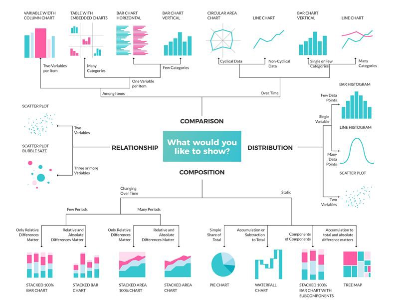

### Project Overview & Setup

In this project, you will work together to create a `pandas` DataFrame containing data on each member of the class, which you will later use to create data visualizations using `matplotlib`. 

_This project has two phases:_

1. **Collaborative Data Collection**: You will work together as a class to design and collect data into a single DataFrame.
2. **Independent Visualization**: You will choose an aspect of the data to create your own data visualization using `matplotlib`.

<html>
  <details>
    <summary>💻 <strong class="text-green-200">PROJECT PROGRAM SETUP INSTRUCTIONS</strong></summary>
    
<div class="setup" markdown="block">

1. Go to the public template **repository** for our class: [BWL-CS Python Template](https://github.com/BWL-CS/python-template)
2. Click the <button type="button" name="button" class="btn btn-green">Use this template</button> button above the list of files then select `Create a new repository`
3. Specify the **repository name**: `CS3-Project-ClassViz`
4. Click <button type="button" name="button" class="btn btn-green">Create repository</button>
    > Now you have **your own personal copy** of this starter code that you can always access under the `Your repositories` section of GitHub! 📂
5. Now on your repository, click <button type="button" name="button" class="btn btn-green"> < > Code </button> and select the `Codespaces` tab
6. Click `Create Codespace on main` and wait for the environment to load, _then you're ready to code_!

</div>

<br>

<div class="warn" markdown="block">

🛑 When class ends, don't forget to **SAVE YOUR WORK**! **Codespaces** are TEMPORARY editing environments, so you need to COMMIT changes properly in order to update the main **repository** for your program. 

_There are multiple steps to saving in GitHub Codespaces:_

1. Navigate to the `Source Control` menu on the _LEFT_ sidebar
2. Click the <button type="button" name="button" class="btn btn-green">commit changes</button> button on the _LEFT_ menu
3. Type a brief **commit message** at the top of the file that opens, for example: `updated main.py`
4. Click the small `✔️` **checkmark** in the _TOP RIGHT_ corner
5. Click the <button type="button" name="button" class="btn btn-green">sync changes</button> button on the _LEFT_ menu
6. _Finally you can close your Codespace!_

</div>

  </details>
</html>


---

### Instructions & Requirements

#### PART A: Collaborative Data Collection

In this part, the class will work together to design a Pandas DataFrame that contains data on each student. You will be interviewing your classmates to gather this data.

<div class="task" markdown="block">

1. **Choose the Columns for the DataFrame**: 
    - Decide as a class what kinds of data to collect. _Examples:_
      - Name
      - Age
      - Favorite Subject
      - Number of Siblings
      - Favorite Movie Genre
      - Hours Spent on Hobbies per Week
      - GPA
      - Favorite Sports Team
      - Any other creative data you come up with as a class!
2. **Conduct Interviews**: 
    - Each student will interview the rest of the classmates to fill in the data in the Google Sheet.
    - Make sure you are accurate and respectful when collecting information.
4. **Load CSV into a DataFrame**:
    - **File** → **Download** the class data sheet as a `.csv` file.
    - In your Python program, read the CSV into a pandas DataFrame.
      - _Example:_
        ```python
        df = pd.read_csv('class-data.csv')
        ```
</div>

---

#### PART B: Independent Data Visualization

Now that we have a class DataFrame, you will each work independently to create your own **unique** data visualizations. You will choose any subset of the data to visualize using `matplotlib`. You are free to explore any kind of visualization that helps you understand the data better.

<div class="imp" markdown="block">

Here are some common types of visualizations that `matplotlib` can create:
- **Bar Chart**: Useful for comparing categories of data.
- **Line Plot**: Great for showing trends over time or continuous data.
- **Scatter Plot**: Useful for showing the relationship between two variables.
- **Pie Chart**: Ideal for showing parts of a whole (distribution of categories).
- **Histogram**: Perfect for showing the distribution of a single variable.

</div>

<br>

<div class="task" markdown="block">
  
1. **Choose Your Focus**:
    - Decide what part of the class DataFrame you want to visualize. This could be:
      - A comparison of favorite subjects.
      - A bar chart showing the average GPA of students by their favorite sports teams.
      - A line plot tracking the number of siblings each student has by age.
      - A pie chart showing the distribution of favorite movie genres.
2. **Create Your Visualization**:
    - Using `matplotlib`, create your visualization.
      - You can _clean_ or _filter_ the data as needed.
      - Use `plt.savefig('figure1.png', bbox_inches='tight')` to _save your figure_ as a PNG.
      - Feel free to explore and create as many figures as you want, but check with me to make sure you generate **at least ONE type of visualization** that no one else in the class is doing!!!
3. **Interpret the Visualization**:
    - In a `''' multi-line comment '''`, write a few sentences about what your visualization tells you about the data.
    - What _trends_, _patterns_, or _insights_ can you gather from your chart?


</div>

---

### Choosing Appropriate Visualizations 📊

{:.highlight}
💡 Choosing the right type of visualization is crucial for effectively communicating your findings. Below are some **guidelines** to help you decide. Check out this resource from [UC Berkeley](https://guides.lib.berkeley.edu/data-visualization/about) for additional tips.

#### Example Chart Selection Table

| **Question Type**              | **Recommended Chart Type**       |
|--------------------------------|----------------------------------|
| Proportions within a whole                    | Pie chart, Stacked bar plot, Word cloud      |
| Trends over time, sequential events              | Line plot, Animated plots                        |
| Distribution of a variable     | Histogram, Box plot (comparing between groups)             |
| Comparison across categories   | Bar plot, Grouped bar plot (catplot)      |
| Relationships between variables| Scatter plot (two variables), Heatmap (multiple variables)            |


